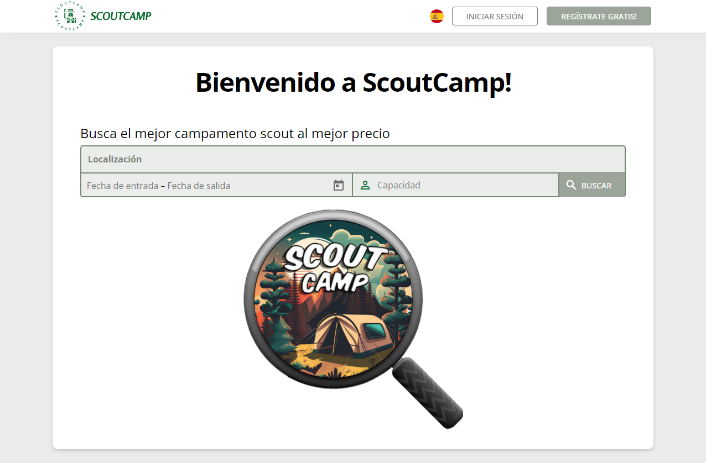
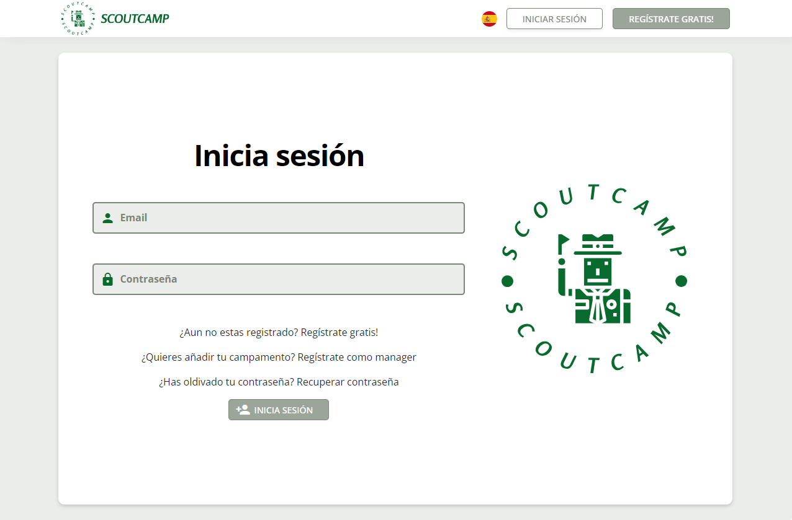

# ScoutCamp - Sistema de gestión de reservas de en centros Scouts (TFG)

Este repositorio contiene el código fuente y la documentación relacionada con el FrontEnd de mi Trabajo de Fin de Grado (TFG) titulado "ScoutCamp: Sistema de gestión de reservas de en centros Scouts", desarrollado en el marco de **Ingenieria Informatica** en la **Universidad de Málaga**.

## Descripción

El proyecto **ScoutCamp** es una aplicación web desarrollada en Angular que tiene como objetivo simplificar la gestión de reservas para campamentos scouts. Proporciona una interfaz intuitiva tanto para los usuarios que desean realizar reservas como para los administradores encargados de administrar y supervisar el sistema.

## Características

- [x] Autenticación segura de usuarios y gestión de roles.
- [x] Exploración de campamentos disponibles con información detallada.
- [x] Proceso de reserva intuitivo con selección de fechas y opciones.
- [x] Panel de administración para gestionar campamentos y reservas.
- [x] Notificaciones por correo electrónico para usuarios y administradores.
- [x] Interfaz amigable y adaptada a dispositivos móviles.
- [x] Soporte multilingüe (Español, Ingles, Francés, Alemán).
- [x] Comentarios y Calificaciones de los campametos reservados.
- [x] Correo interno entre usuarios, campamentos y administradores.

## Capturas de Pantalla

_Pagina de inicio_

_Pagina de inicio de sesión_

## Instalación y Uso

1. Asegúrate de tener Node.js y Angular CLI instalados.
2. Clona este repositorio: `git clone https://github.com/QuintaPe/frontTFG.git`
3. Instala las dependencias: `npm install`
4. Ejecuta la aplicación: `ng serve`
5. Abre tu navegador en `http://localhost:4200/`

## Estructura del Proyecto

- **app:**
  - **auth:** Autenticación y registro de usuarios.
  - **admin:** Panel de administración para gestionar campamentos y reservas.
  - **manager:** Gestión de recursos y detalles de campamentos.
  - **user:** Experiencia de usuario para explorar y reservar campamentos.
  - **camping:** Módulo específico para la gestión de campamentos.
  - **shared:** Componentes y pipes reutilizables en todos los módulos.
  - **core:** Servicios, guardas, modelos y constantes compartidas.
- **app.component:** Componente principal de la aplicación.
- **app.routes.ts:** Configuración de enrutamiento.

## Futuras lineas
- [ ] Implementación de sistema de pago en línea para las reservas.
- [ ] Integración de notificaciones push para mantener a los usuarios informados en tiempo real.
- [ ] Mejoras en la interfaz de administración para una gestión más eficiente.
- [ ] Ampliación de opciones de personalización de campamentos.
- [ ] Integración con plataformas de redes sociales para compartir experiencias

## Contacto
- [Alejandro Quintana Pérez](mailto:alexquintape@gmail.com)
- [GitHub](https://github.com/QuintaPe/)
- [LinkedIn](https://www.linkedin.com/in/alejandroqp/)

